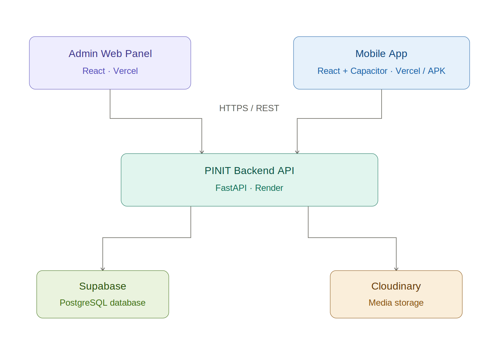
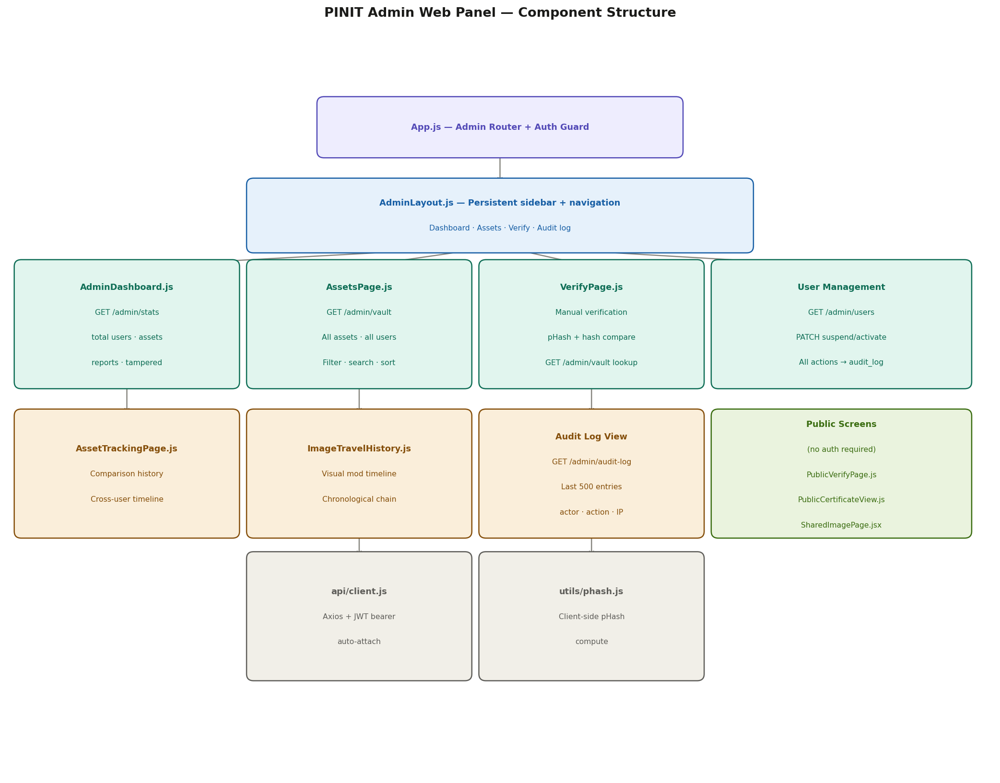

<div align="center">


# PINIT — Admin Web Panel

[](https://react.dev)
[](https://image-crypto-analyzer.vercel.app)
[]()

**[Live Admin Panel](https://image-crypto-analyzer.vercel.app)** | **[API Docs](https://pinit-backend.onrender.com/docs)** | **[Backend Repo](https://github.com/mannevi/pinit-backend)** | **[Mobile App Repo](https://github.com/mannevi/pinit-mobile)**

</div>

---

PINIT is an **image forensics and ownership verification platform**. It embeds a unique UUID invisibly into every pixel of an image at the point of capture — creating a tamper-evident cryptographic fingerprint that proves both **authenticity and ownership**.

This repository contains the **Admin Web Panel** — a React SPA giving PINIT administrators full visibility and control over users, assets, forensic reports, and audit logs.

> 🔒 Access is restricted to users with `role: admin`. A `RequireAuth` gate blocks all non-admin accounts at the route level.

---

## 📰 News

- 🚩 **[2026.04]** Admin Panel presented to enterprise clients — all management features live and stable.
- 🚩 **[2026.03]** Admin Panel separated into its own dedicated repository. Mobile user code fully removed.
- 🚩 **[2026.02]** Asset tracking, audit log, and forensic report review features deployed.
- 🚩 **[2026.01]** Initial combined platform launched — Admin Panel and Mobile App in a single codebase.

---

## 📜 Introduction

The PINIT Admin Panel provides administrators with a comprehensive management interface over the entire platform. It connects to the shared PINIT Backend API and surfaces data across all users, assets, and forensic events.

Administrators can:

1. **Monitor platform health** — view real-time statistics on total users, vaulted assets, forensic reports generated, and tampered images detected across the platform.

2. **Manage users** — view all registered accounts, suspend or reactivate users. Every admin action is written to a tamper-proof audit log with actor ID, timestamp, and IP address.

3. **Investigate assets and reports** — drill into any vaulted image across any user, review its full forensic comparison history, and view the complete modification timeline.

---

## 🏗️ Architecture



The Admin Panel is a **React SPA deployed on Vercel**. All admin screens sit inside `AdminLayout` (persistent sidebar). Public screens — verify, certificate, shared image — are accessible without authentication. The `RequireAuth` gate blocks non-admins from all protected routes.
## 🧩 Component Structure



---

## 🗂️ Project Structure

```
image-crypto-analyzer/
│
├── public/                           # 🌐 Static assets and HTML entry point
├── src/
│   ├── App.js                        # 🚀 Route definitions and auth state management
│   │
│   ├── api/
│   │   └── client.js                 # 🔌 Centralised Axios instance with auth headers
│   │
│   ├── components/                   # 🖥️ Admin screens and views
│   │   ├── AdminLayout.js            # 🗂️ Persistent sidebar navigation (wraps all admin routes)
│   │   ├── AdminDashboard.js         # 📊 Platform overview — stats cards, recent activity
│   │   ├── AssetsPage.js             # 🗄️ Full platform asset listing with filters
│   │   ├── AssetDetailPage.js        # 🔍 Per-asset metadata and ownership view
│   │   ├── AssetTrackingPage.js      # 📍 Asset history across all comparison events
│   │   ├── ImageTravelHistory.js     # 🗺️ Visual modification timeline for an asset
│   │   ├── ImageCryptoAnalyzer.js    # 🔬 Core forensic analysis interface
│   │   ├── VerifyPage.js             # ✅ Manual image verification tool
│   │   ├── PublicVerifyPage.js       # 🌐 Public verification — no login required
│   │   ├── PublicCertificateView.js  # 📜 Public certificate display page
│   │   ├── SharedImagePage.jsx       # 🔗 Shared asset view via token link
│   │   ├── Login.js                  # 🔑 Admin login screen
│   │   ├── Register.js               # 📝 Admin account registration
│   │   └── ResetPassword.js          # 🔓 Password reset via email link
│   │
│   └── utils/
│       ├── auth.js                   # 🔒 Token storage and session helpers
│       └── phash.js                  # 🧮 Client-side perceptual hash computation
│
├── .env.example                      # 🔐 Environment variable reference
├── vercel.json                       # ⚙️ Vercel SPA routing configuration
└── package.json                      # 📦 Dependencies
```

---

## ✨ Admin Features

### 📊 Dashboard
Real-time platform statistics — total registered users, total vaulted assets, total forensic reports, and tampered images detected across all users.

### 👥 User Management
Complete user table with account status controls. Admins can **suspend** or **reactivate** any user account. Every action is written to the audit log with actor ID, timestamp, and IP address.

### 🗄️ Asset Management
Full visibility across all vaulted images on the platform — across every user. Each asset record displays:

| Field | Description |
|---|---|
| Owner | User identity linked to the certified asset |
| File hash | SHA-256 cryptographic hash of the original image |
| Visual fingerprint | Perceptual hash (pHash) for similarity matching |
| Resolution | Image dimensions at time of certification |
| Capture timestamp | Date and time of original certification |
| Device ID | Device used to capture the image |

### 🔬 Forensic Reports
Review all comparison reports generated by users. Each report includes:

| Field | Description |
|---|---|
| Verdict | `EXACT MATCH` / `STRONG MATCH` / `PARTIAL MATCH` / `WEAK SIMILARITY` / `NO MATCH` |
| Confidence | Calibrated 0–100% match score |
| pHash similarity | Perceptual hash Hamming distance |
| Histogram similarity | Bhattacharyya colour channel analysis |
| Pixel diff | Structural change detection map |
| Editing tool | Detected software used to modify the image |

### 📍 Asset Tracking
Trace the full modification history of any image — every comparison event it has been involved in, across all users, in chronological order.

### 📋 Audit Log
Complete log of every admin action — user suspensions, activations, and access events — with actor ID, action type, IP address, and timestamp.

### 🌐 Public Pages *(no login required)*
Certificate verification (`/public/certificate/:id`) and shared image pages (`/share/image/:token`) are publicly accessible — these are the links users share externally to allow third parties to verify image authenticity without a PINIT account.

---

## 🚀 Getting Started

### Prerequisites

- Node.js 18+
- PINIT backend running locally or use the hosted API at `https://pinit-backend.onrender.com`

### Installation

1. Clone the repository

```sh
git clone https://github.com/mannevi/image-crypto-analyzer.git
cd image-crypto-analyzer
```

2. Install dependencies

```sh
npm install
```

3. Configure environment variables

```sh
cp .env.example .env
# Set REACT_APP_API_URL in .env
```

4. Start the development server

```sh
npm start
```

App runs at `http://localhost:3000`. Admin credentials required to access the dashboard.

---

## ⚙️ Environment Variables

| Variable | Description |
|---|---|
| `REACT_APP_API_URL` | PINIT backend base URL |

> In production, environment variables are configured in the Vercel project dashboard — not via a committed `.env` file.

---

## 🔗 Related Repositories

| Repository | Description | URL |
|---|---|---|
| [pinit-backend](https://github.com/mannevi/pinit-backend) | Shared FastAPI backend — serves both admin and mobile | https://pinit-backend.onrender.com |
| [pinit-mobile](https://github.com/mannevi/pinit-mobile) | User Mobile App (React + Capacitor / Android APK) | https://pinit-mobile.vercel.app |

---

© 2026 PINIT. All rights reserved.
